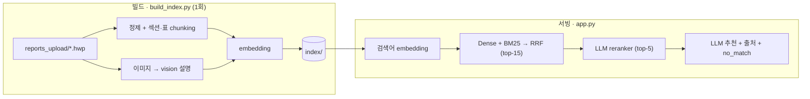

# 국가 LCI DB 검색 (RAG)

[](https://github.com/lululalalalalalalalaaa/prototype/actions/workflows/ci.yml)


**자연어로 물어보면 가장 알맞은 국가 LCI(전과정 목록분석) DB를 출처와 함께 찾아주는 검색 도구입니다.**

국가 LCI DB(제품 1단위의 온실가스 등 환경영향 데이터)는 종류가 많고 이름이 비슷해 찾기 어렵습니다.
평범한 말로 입력하면 가장 맞는 DB를 추천하고, 보고서 핵심(기능단위·시스템경계·영향평가 수치)을 요약합니다.

```
입력:  디젤 기차로 사람을 수송할 때 온실가스 배출
──────────────────────────────────────────────────
추천:  여객수송용 디젤기차 수송
출처:  「여객수송용 디젤기차 수송」 보고서 · 📑 공정흐름도(그림)   ← 보고서 그림을 vision으로 읽음
세부:  기능단위 1 person·km · gate-to-gate · Climate change_Total 4.95E-02 kg CO2 eq
```

> 데이터에 없는 주제(항공·철강 등)는 억지로 고르지 않고 **"적합 DB 없음"으로 정직하게** 답합니다.

## 빠른 시작

```bash
uv sync                                   # 1) 의존성 설치
cp .env.example .env                      # 2) .env에 OPENAI_API_KEY= 입력
uv run python scripts/build_index.py      # 3) reports_upload/ 보고서 → index/ 빌드(오프라인, 1회)
uv run streamlit run app.py               # 4) 앱 실행
```

## 동작 방식

빌드(오프라인 1회)와 서빙(읽기 전용)을 분리합니다. 빌드가 embedding·vision 비용을 모두 흡수하고,
서빙은 불변 아티팩트 `index/`(npz+jsonl)를 읽기만 해 **벡터DB 서버 없이** 파일만 배포하면 됩니다.



## 검색 품질 — 측정으로 증명

각 단계의 기여를 **골든셋 105문항**(90 정답 + 15 no_match)으로 측정합니다(`eval/run_eval.py`).

| 단계 | Recall@5 | MRR |
|---|---|---|
| Dense (embedding만) | 0.956 | 0.811 |
| + BM25 hybrid | 0.933 | 0.794 |
| **+ LLM reranker** | **0.989** | **0.972** |

- grounding: off-domain 15문항 **기권 정확도 1.000**, 답 있는 90문항 **응답 0.989**.
- 내용 질의(이름이 아닌 공정·연료·기능단위로 물은 12문항): **12/12** 정답.

## 설계 핵심

- **build/serve 분리** — 불변 `index/` 아티팩트, 읽기 전용 서빙 → 동시성 안전·DB 서버 불필요·git 배포.
- **구조를 보는 인제스션** — HWP 폼 노이즈 정제 + 섹션·표 단위 chunking + 공정흐름도 이미지 vision 텍스트화.
- **검증 가능한 출처** — *어느 문서 어느 섹션*인지 표시하고, 추천 DB를 누르면 보고서 원문까지 펼쳐 확인.
- **측정 기반 결정** — 변경마다 eval로 회귀를 검증. *호출 병합*·*embedding large*는 측정 후 반려(→ `logging.md`).

## 프로젝트 구조

```
config/rules.yaml   설정 단일 소스(모델·임계치·단가 — 하드코딩 금지)
scripts/build_index.py   오프라인 인덱서 → index/(증분)
rag/
  ingest/   loaders·chunk·images (파싱·정제 / 섹션·표 chunking / 이미지 vision)
  embed·store·retrieve   embedding / 아티팩트 / 코사인+BM25+출처
  rerank·generate·usage·pipeline   reranker / 추천·요약 / 토큰·비용 / search() 조립
eval/   golden.jsonl(105) + run_eval.py     tests/   단위 테스트(키 불필요)
app.py   얇은 Streamlit UI(추천·출처·원문·로깅)
```

## 운영 (데이터를 바꿀 때)

1. `reports_upload/`에 보고서 추가/교체 (파일명 = DB 이름)
2. `uv run python scripts/build_index.py` — 변경분만 재빌드(증분). chunking 로직을 바꿨다면 `index/`를 비우고 풀빌드.
3. `git add index/ && git commit && git push` — 배포는 이 `index/`를 사용. 앱은 우측 상단 **"인덱스 다시 불러오기"**.

배포: [Streamlit Cloud](https://streamlit.io/cloud)에 repo 연결(`app.py` 지정, `OPENAI_API_KEY`를 Secrets) → push마다 자동.

## 더 알아보기

- **설계·컨벤션·핵심 결정** → [`CLAUDE.md`](CLAUDE.md) · **보고서 형식** → [`reports_upload/README.md`](reports_upload/README.md)
- 작업 이력·측정값 → [`logging.md`](logging.md) · 다음 할 일 → [`Nextsession.md`](Nextsession.md)
