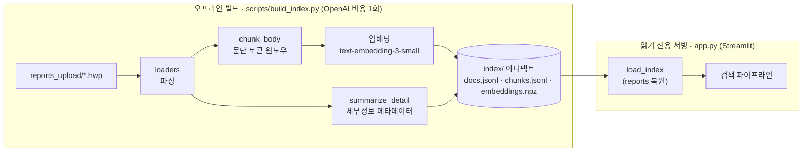
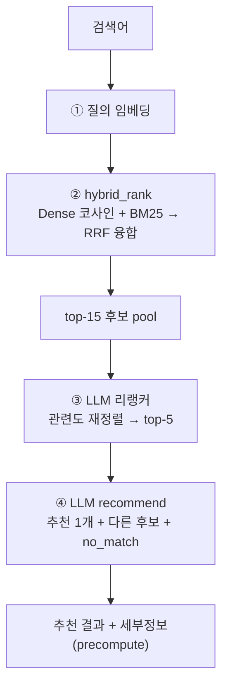
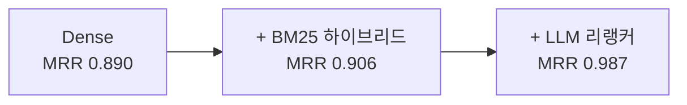

# 국가 LCI DB 검색 (RAG)

자연어로 질문하면 가장 적합한 **국가 LCI(전과정 목록분석) DB**를 추천하는 검색 시스템입니다.
사용자가 "전기차로 사람을 수송할 때 온실가스 배출 데이터"처럼 입력하면, 임베딩·BM25·LLM
리랭커를 거쳐 가장 알맞은 LCI DB를 근거와 함께 제시하고, 보고서 세부정보(기능단위·시스템경계·
영향평가 결과 등)를 요약해 보여줍니다.

> **PoC**입니다. 별도 벡터DB 서버 없이, 오프라인으로 만든 인덱스 아티팩트(`index/`)를
> Streamlit 앱이 읽기 전용으로 서빙합니다. 배포는 `index/` + 코드를 업로드하면 끝입니다.

---

## 핵심 특징

- **검색 품질을 수치로 검증** — 골든셋 + `eval/run_eval.py`로 각 단계의 기여를 측정(아래 표).
- **하이브리드 + 리랭커** — Dense(임베딩) + BM25(정확 토큰)를 RRF로 융합하고, LLM이 관련도로 재정렬.
- **build/serve 분리** — 임베딩 비용은 오프라인 빌드 1회. 서빙은 읽기 전용 → 동시성 안전.
- **의존성 최소** — 순수 파이썬 BM25/코사인(외부 벡터DB·torch 없음). Python 3.14 + numpy/openai/streamlit.
- **그라운딩** — 데이터에 없는 주제(철강·항공 등)는 LLM이 "적합 DB 없음"으로 올바르게 기권.

## 검색 품질 (보강 골든셋 46문항, k=5)

| 단계 | Recall@5 | MRR | 비고 |
|---|---|---|---|
| Dense (임베딩만) | 0.961 | 0.890 | 청크-max 코사인 |
| + BM25 하이브리드(RRF) | 0.974 | 0.906 | 정확 토큰(경남·수도권) 보강 |
| **+ LLM 리랭커** | **1.000** | **0.987** | 의미·동의어(전라남도=전남) 해결 |

추가로 **그라운딩**(전체 파이프라인 실측): off-domain 8문항 기권 정확도 **1.000**,
답 있는 38문항 응답 정확도 **0.974**(과잉기권 0).

---

## 아키텍처 — build/serve 분리



빌드는 `body_hash`로 **증분**(변경 없는 문서는 재임베딩하지 않음). 서빙은 인덱스를 메모리에 읽어
질의에 응답할 뿐 쓰지 않으므로, 다중 사용자에도 파일 경합이 없습니다.

## 검색 파이프라인



검색 1회당 OpenAI 호출 3회(임베딩 → 리랭커 → 추천). 세부정보는 빌드 시점에 미리 계산되어
모달은 즉시 표시됩니다.

## 단계별 품질 사다리



각 단계는 같은 골든셋으로 before/after를 측정해 기여를 증명했습니다(`eval/run_eval.py --mode dense|hybrid|rerank`).

---

## 빠른 시작

```bash
# 1) 의존성 설치
uv sync

# 2) OpenAI 키 설정 — .env.example을 복사해 키 입력
cp .env.example .env        # 그리고 OPENAI_API_KEY= 뒤에 키 붙여넣기

# 3) 보고서를 reports_upload/에 넣고, 인덱스 빌드(오프라인, 임베딩 비용)
uv run python scripts/build_index.py

# 4) 앱 실행 (index/를 읽기 전용 로드)
uv run streamlit run app.py
```

지원 보고서 형식: `.hwp`(한글 5.0) · `.txt` · `.md` · `.csv` · `.json` (자세한 규칙은 `reports_upload/README.md`).

## 평가

```bash
uv run python eval/run_eval.py --mode dense  --k 5   # 임베딩만
uv run python eval/run_eval.py --mode hybrid --k 5   # + BM25
uv run python eval/run_eval.py --mode rerank --k 5   # + LLM 리랭커 (검색 품질)
uv run python eval/run_eval.py --mode answer         # 전체 파이프라인 그라운딩(응답/기권)
```

`eval/golden.jsonl`이 정답지(질의 → 정답 DB 이름). 질의 임베딩·리랭크·응답 결과는 캐시되어
재실행은 빠릅니다. (키 + `index/` 필요)

## 테스트

```bash
uv run pytest          # 전체 (API 키 불필요 — mock 클라이언트)
```

각 단계(로더·청킹·임베딩·검색·BM25·리랭커·저장·빌드)가 단독 단위 테스트로 검증됩니다.
실제 `.hwp` 파일에 대한 회귀 테스트도 포함됩니다.

## 프로젝트 구조

```
config/rules.yaml        설정 단일 소스 (모델·임계치·청킹·RRF·rerank_pool)
scripts/build_index.py   오프라인 인덱서 → index/ (증분)
index/                   불변 아티팩트 (gitignore): docs.jsonl·chunks.jsonl·embeddings.npz
rag/
  config·clients         설정 로더 / OpenAI 클라이언트 단일 생성 지점
  ingest/loaders·chunk   파일 파싱(HWP 포함) / 문단 토큰 윈도우 청킹
  embed·store            임베딩 / 인덱스 아티팩트 저장·로드
  retrieve               코사인 + BM25(순수 파이썬) + hybrid_rank(RRF)
  rerank·generate        LLM 리랭커 / 추천·세부정보
  pipeline               search() = hybrid → rerank → recommend
eval/                    golden.jsonl + run_eval.py (dense|hybrid|rerank|answer)
tests/                   단계별 단위 테스트
app.py                   얇은 Streamlit UI (읽기 전용)
```

## 기술 메모

- **모델**: 추천·요약 `gpt-5.4-nano`, 임베딩 `text-embedding-3-small` (둘 다 `config/rules.yaml`).
- **순수 파이썬 BM25/코사인** — 외부 벡터DB·numpy 연산 의존 없이 손구현(규모가 커지면 numpy 벡터화 고려).
- **한글 BM25 토크나이저** — 음절 bigram(예: '경남'↔'경남권')+영숫자 토큰(MDF·LPG). 형태소 분석기 불필요.
- **macOS HWP 파일명**은 NFD라 NFC 정규화 후 처리(`clean_db_name`).
- **비공개 데이터** — `reports_upload/`·`index/`·`lci_reports.json`은 git에 올라가지 않습니다.
