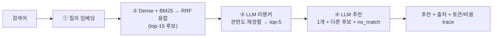

# 국가 LCI DB 검색 (RAG)

[](https://github.com/lululalalalalalalalaaa/prototype/actions/workflows/ci.yml)


**자연어로 물어보면 가장 알맞은 국가 LCI(전과정 목록분석) DB를 찾아주는 검색 도구입니다.**

국가 LCI DB는 *"제품·서비스 1단위를 만들거나 쓸 때 나오는 온실가스 등 환경영향"*을 정리한 공개 데이터셋입니다.
종류가 많고 이름이 서로 비슷해(디젤·전기·LPG 승용차/기차/버스, 지역별 공업·생활용수 등) 원하는 걸 찾기 어렵습니다.
이 도구는 **평범한 말로 입력**하면 임베딩 + 키워드 + LLM으로 가장 맞는 DB를 **근거와 함께** 추천하고,
보고서 핵심(기능단위·시스템경계·영향평가 수치)을 요약해 보여줍니다.

### 예시

```
입력:  디젤 기차로 사람을 수송할 때 온실가스 배출
──────────────────────────────────────────────────
추천:  여객수송용 디젤기차 수송
근거:  📑 공정흐름도 — "디젤 → 수송공정 → 대기배출물"   (보고서 그림을 읽어 표시)
세부:  기능단위 1 person·km · 시스템경계 gate-to-gate · Climate change_Total 4.95E-02 kg CO2 eq
다른 후보:  화물수송용 디젤기차 수송
```

> 데이터에 없는 주제(항공·철강·발전 등)는 억지로 고르지 않고 **"적합 DB 없음"으로 정직하게** 답합니다.

---

## 빠른 시작

```bash
uv sync                                   # 1) 의존성 설치
cp .env.example .env                      # 2) .env에 OPENAI_API_KEY= 입력
uv run python scripts/build_index.py      # 3) reports_upload/ 보고서 → index/ 빌드(오프라인, 1회)
uv run streamlit run app.py               # 4) 앱 실행(index/ 읽기 전용 로드)
```

키가 없어도 앱은 뜨지만 검색·요약은 비활성화됩니다. 지원 형식: `.hwp`(한글)·`.txt`·`.md`·`.csv`·`.json`
(규칙은 [`reports_upload/README.md`](reports_upload/README.md)).

## 운영 — 보고서 추가·재빌드·배포

처음 설치 이후, **데이터를 바꿀 때마다** 반복하는 절차입니다.

1. **보고서 추가/교체** — `reports_upload/`에 파일을 넣습니다(파일명 = DB 이름).
2. **인덱스 재빌드** — `uv run python scripts/build_index.py`
   - `body_hash`로 **변경분만** 재임베딩(증분)이라 비용이 적습니다.
   - 단, *정제·청킹·이미지 로직 자체를 바꿨다면* 본문이 같아도 청크가 달라지므로 `index/`를 비우고 풀빌드:
     `rm index/*.jsonl index/*.npz && uv run python scripts/build_index.py`
3. **커밋·푸시** — `git add index/ && git commit -m "data: rebuild index" && git push`
   (배포는 이 `index/`를 그대로 사용합니다.)
4. **앱에 반영** — 실행 중이면 우측 상단 **"인덱스 다시 불러오기"**(또는 서버 재시작).
5. **품질 확인** — 검색에 영향 주는 변경이면 `eval/run_eval.py --mode rerank|answer`로 회귀를 점검합니다.

### 배포 (Streamlit Cloud)

1. repo를 [Streamlit Community Cloud](https://streamlit.io/cloud)에 연결하고 진입점을 `app.py`로 지정.
2. `OPENAI_API_KEY`를 앱 **Secrets**에 등록(BYOK).
3. `index/`가 repo에 커밋돼 있어 **별도 데이터 업로드 없이** 바로 서빙됩니다. 이후 `git push`마다 자동 재배포.

## 동작 방식



- **빌드(오프라인 1회)와 서빙(읽기 전용)을 분리** — 임베딩·이미지 vision 비용은 빌드 때만. 서빙은 `index/`
  아티팩트(npz+jsonl)를 메모리에 읽어 답할 뿐 쓰지 않아 동시성에 안전합니다. **별도 벡터DB 서버 불필요**(파일만 배포).
- **인제스션이 구조를 본다** — HWP 폼 노이즈를 정제하고, 섹션(`N. 제목`)·표(`표.`) 단위로 청킹하며,
  공정흐름도 **이미지를 vision 모델로 텍스트화**해 함께 색인합니다. 그래서 출처가 "📑 영향평가 결과(표)"처럼 위치까지 나옵니다.

## 검색 품질 (골든셋 105문항, k=5)

각 단계의 기여를 같은 골든셋으로 측정합니다(`eval/run_eval.py`).

| 단계 | Recall@5 | MRR |
|---|---|---|
| Dense (임베딩만) | 0.956 | 0.811 |
| + BM25 하이브리드 | 0.933 | 0.794 |
| **+ LLM 리랭커** | **0.989** | **0.972** |

- 그라운딩: 데이터에 없는 15문항 **기권 정확도 1.000**, 답 있는 90문항 **응답 정확도 0.989**.
- 내용 질의(이름이 아닌 공정·연료·기능단위로 물은 12문항): **12/12** 정답.

## 프로젝트 구조

```
config/rules.yaml        설정 단일 소스(모델·임계치·단가 등 — 코드 하드코딩 금지)
scripts/build_index.py   오프라인 인덱서 → index/ (증분)
index/                   불변 아티팩트: docs.jsonl·chunks.jsonl·embeddings.npz
rag/
  ingest/loaders·chunk·images   파싱·정제 / 섹션·표 청킹 / 이미지 vision
  embed·store·retrieve          임베딩 / 아티팩트 저장·로드 / 코사인+BM25+출처
  rerank·generate·usage         LLM 리랭커 / 추천·요약 / 토큰·비용
  pipeline                      search() = hybrid → rerank → recommend + trace
eval/                    golden.jsonl(105문항) + run_eval.py
tests/                   단계별 단위 테스트(API 키 불필요 — mock)
app.py                   얇은 Streamlit UI(읽기 전용)
```

## 개발

```bash
uv run pytest                                  # 테스트(키 불필요)
uv run python eval/run_eval.py --mode rerank   # 검색 품질(Recall@k/MRR) — 키 + index/ 필요
uv run python eval/run_eval.py --mode answer   # 전체 파이프라인 그라운딩(응답/기권)
```

`.github/workflows/ci.yml`이 push·PR마다 `pytest` + `cspell`을 자동 실행합니다.

## 더 알아보기

- **설계·컨벤션·핵심 결정**: [`CLAUDE.md`](CLAUDE.md)
- **작업 이력·측정값**: [`logging.md`](logging.md) · **다음 할 일**: [`Nextsession.md`](Nextsession.md)
- 데이터 공개: `index/`(보고서 본문 포함)는 배포 위해 커밋, `.env`·`reports_upload/` 원본·캐시는 git 제외.
